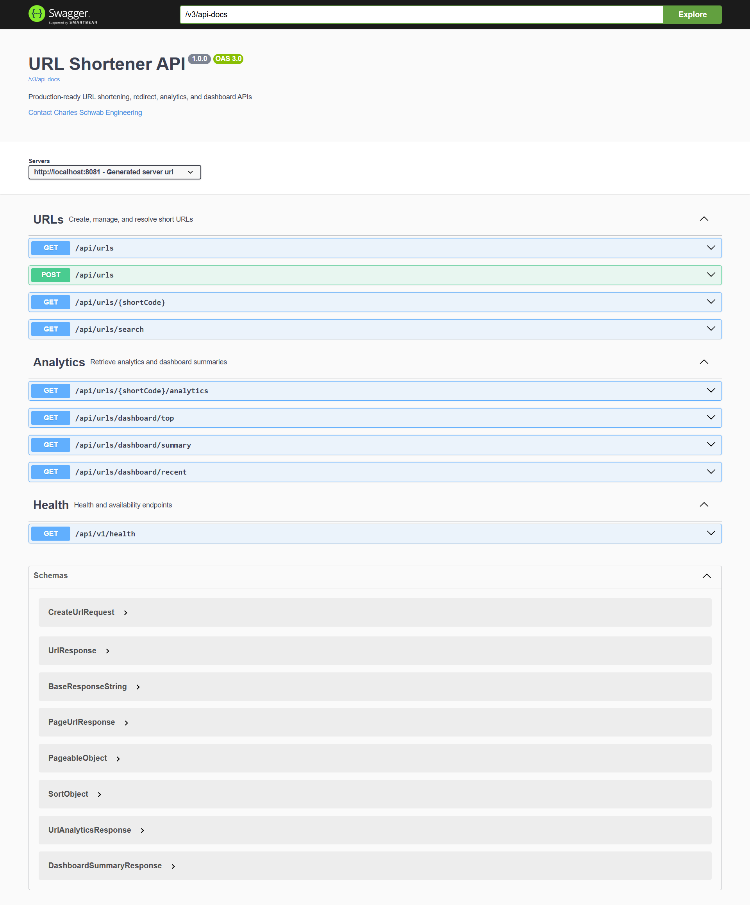
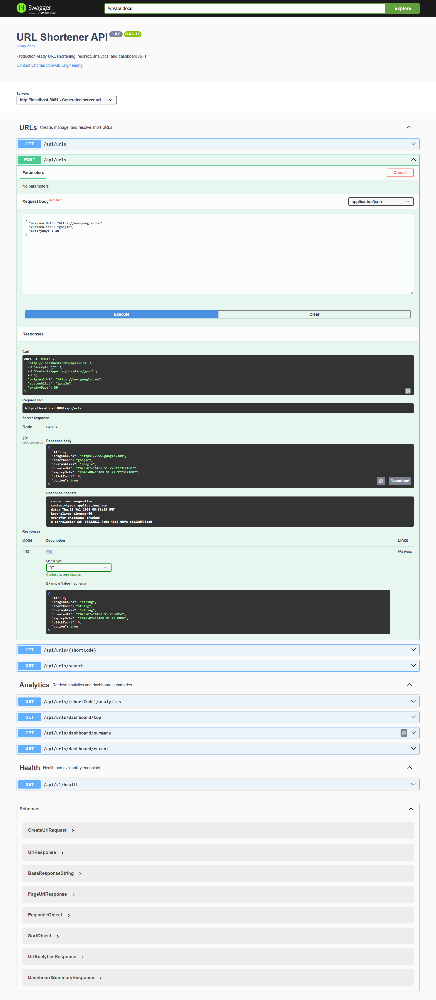
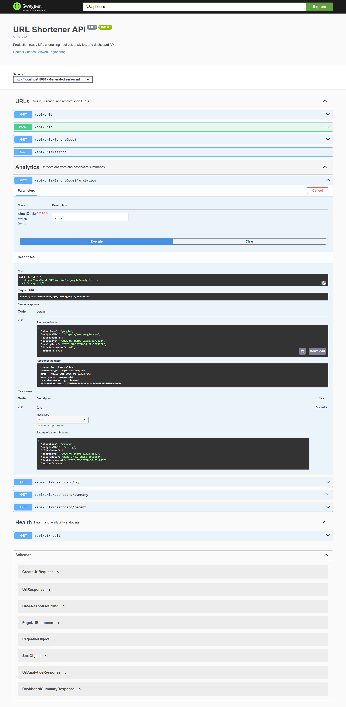
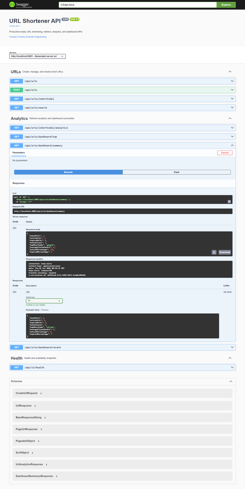
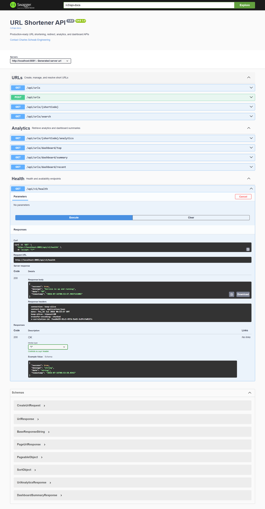
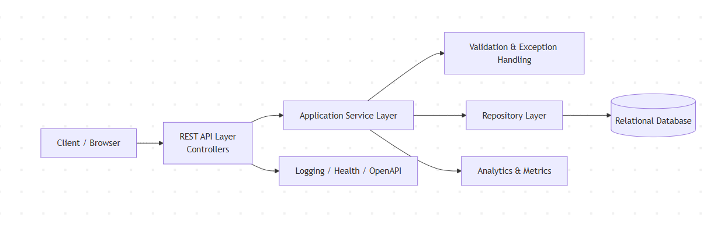

# URL Shortener Service — AI-Assisted Engineering Assessment

This repository contains a Spring Boot 3 / Java 21 URL shortener backend implemented as a prototype and engineering assessment. The codebase demonstrates a layered design, validation, analytics, and AI-assisted development artifacts.

## Start Here

- Primary entry: [docs/02_final-engineering-summary.md](docs/02_final-engineering-summary.md)
- Secondary reading: [docs/scenarios/](docs/scenarios/), [docs/03_architecture.md](docs/03_architecture.md), [docs/04_ai-traceability.md](docs/04_ai-traceability.md), [docs/01_setup-guide.md](docs/01_setup-guide.md)

## Current Status

- Build status: verified with Maven `verify`
- JaCoCo line coverage: 74.58% (enforced minimum: 70% interim gate; long-term target: 80%)
- Test suite: 12 test files under `src/test/java`
- Static analysis: configured (SpotBugs, PMD, Checkstyle)
- Dependency vulnerability scanning: configured (OWASP Dependency Check)
- Authentication and rate limiting: not implemented yet

## What Is Implemented

- URL creation with optional custom alias and expiry configuration
- Redirect handling for short codes
- Analytics and dashboard summary endpoints
- Search and pagination support for URL listings
- Bean Validation on the create request DTO
- Centralized exception handling with consistent error responses
- Structured logging and correlation-ID support
- OpenAPI / Swagger documentation
- Health endpoint at /api/v1/health

## Technology Stack

- Language: Java 21
- Framework: Spring Boot 3
- Data Access: Spring Data JPA
- Validation: Spring Validation
- Database: H2 (default, running in PostgreSQL compatibility mode for local development; migration path to PostgreSQL documented in ADR-001)
- API Documentation: springdoc-openapi / Swagger UI
- Build Tool: Maven
- Boilerplate Reduction: Lombok
- Monitoring: Spring Boot Actuator
- Testing: Spring Boot Test, JUnit 5, AssertJ

## Project Structure

```
src/
  main/
    java/com/schwab/urlshortener/
      config/            # OpenAPI, logging, correlation-ID filter
      controller/        # REST controllers
      dto/               # Request and response models
      entity/            # JPA entities
      exception/         # Centralized exception handling
      mapper/            # Mapping helpers
      repository/        # Spring Data repositories
      service/           # Business logic and orchestration
      util/              # Utility helpers
      validation/        # URL validation logic
    resources/
      application.yml   # Runtime and environment configuration
  test/
    java/com/schwab/urlshortener/  # Unit and integration-style tests
```

## GitHub Folder Structure

The repository contains a `.github` folder with structured agent, instruction, prompt, and skill assets supporting the Copilot engineering workflow.

```
.github/
  agents/
    coding-assistant-brownfield.agent.md    # Brownfield engineering agent
    coding-assistant-greenfield.agent.md   # Greenfield engineering agent
    coding-assistant-task-router.agent.md  # Task router agent
  instructions/
    config-logging-conventions.instructions.md      # Config/logging conventions
    controller-conventions.instructions.md          # Controller design rules
    documentation-conventions.instructions.md       # Documentation conventions
    dto-validation-conventions.instructions.md      # DTO validation rules
    exception-handling-conventions.instructions.md  # Exception handling rules
    repository-entity-conventions.instructions.md   # Repository/entity conventions
    security-conventions.instructions.md            # Security and validation guidance
    service-conventions.instructions.md             # Service-layer conventions
    test-conventions.instructions.md                # Test quality expectations
  prompts/
    01-requirement-analysis.md    # Requirement analysis prompt
    02-task-decomposition.md      # Task decomposition prompt
    03-architecture-design.md     # Architecture design prompt
    04-backend-bootstrap.md       # Backend bootstrap prompt
    05-url-creation.md            # URL creation prompt
    06-url-redirection.md         # URL redirection prompt
    07-analytics-dashboard.md     # Analytics/dashboard prompt
    08-enterprise-quality.md      # Enterprise quality prompt
    09-submission-package.md      # Submission/package prompt
  skills/
    api-contract-design/            # API contract design skill
    codebase-impact-analysis/       # Codebase impact analysis skill
    documentation-sync/             # Documentation sync skill
    refactor-safety-check/          # Refactor safety check skill
    regression-test-generation/     # Regression test generation skill
    requirement-analysis/           # Requirement analysis skill
    security-review/                # Security review skill
    spring-boot-scaffolding/        # Spring Boot scaffolding skill
    task-decomposition/             # Task decomposition skill
    test-generation/                # Test generation skill
```

## Build and Run

### Prerequisites

- Java 21
- Maven

### Commands

```bash
mvn clean verify
mvn spring-boot:run
```

The application runs on port 8081 by default.

## API Endpoints

- POST `/api/urls` — Create a shortened URL
- GET `/api/urls` — List and filter URLs
- GET `/api/urls/{shortCode}` — Redirect to the original destination
- GET `/api/urls/{shortCode}/analytics` — Retrieve analytics for a short URL
- GET `/api/urls/search` — Search URLs by short code, original URL, or custom alias
- GET `/api/urls/dashboard/summary` — Return dashboard summary metrics
- GET `/api/urls/dashboard/recent` — Return the most recently created URLs
- GET `/api/urls/dashboard/top` — Return the most clicked URLs
- GET `/api/v1/health` — Return health information

## Example Requests

Create a URL

```bash
curl -X POST http://localhost:8081/api/urls \
  -H "Content-Type: application/json" \
  -d '{"originalUrl":"https://example.com","customAlias":"demo"}'
```

Redirect a Short Code

```bash
curl -i http://localhost:8081/api/urls/demo
```

Retrieve Analytics

```bash
curl http://localhost:8081/api/urls/demo/analytics
```

Retrieve Dashboard Summary

```bash
curl http://localhost:8081/api/urls/dashboard/summary
```

## Documentation and UI

- Swagger UI: http://localhost:8081/swagger-ui.html
- OpenAPI JSON: http://localhost:8081/v3/api-docs
- Setup guide for new engineers: docs/others/setup-guide.md

## Validation and Error Handling

The create endpoint uses Bean Validation through `@Valid` on the request DTO. The validation rules include non-blank input, URL format checks, size constraints, and minimum expiry values. Errors are handled centrally and returned as structured error responses with status, message, and path information.

## Testing and Quality

The repository includes tests for controllers, services, validation, exception handling, config, mapper, and utility behavior. The current verified JaCoCo report shows 74.58% line coverage.

**Static Analysis & Quality Tools Configured:**

- SpotBugs — Static analysis for bug patterns
- PMD — Code quality and best practices analysis
- Checkstyle — Code style enforcement
- OWASP Dependency Check — Vulnerability scanning (CVSS ≥ 7 flagged)

Run all quality checks with:

```bash
mvn verify
```

Current quality-related gaps:

- No load/performance test suite is present yet

## Security and Governance Notes

- No hardcoded secrets were found in `application.yml`; the configuration uses environment-variable placeholders.
- Authentication and rate limiting are not implemented in the current prototype.
- This repository is a prototype-stage assessment — see [docs/02_final-engineering-summary.md](docs/02_final-engineering-summary.md) for limitations and context.

The project documentation and governance artifacts are maintained under `docs/`.

## Future Enhancements

The next practical improvements are:

- Redis caching for redirect lookups
- PostgreSQL as the primary runtime database in non-local environments
- Kafka-based event streaming for analytics and audit events
- Docker and Kubernetes deployment support
- JWT-based authentication and role-based access control
- Rate limiting and abuse protection
- Micrometer, Prometheus, and Grafana integration
- CI/CD automation and deployment pipelines

# AI Assisted Development

GitHub Copilot Agent was used as an engineering accelerator throughout the development lifecycle. It supported requirement analysis, architecture review, implementation scaffolding, refactoring, and documentation drafting. All AI-generated outputs were reviewed, adjusted where necessary, and validated by the engineer before being retained in the repository.

## Screenshots








## Conclusion

This project is a focused prototype demonstrating a layered architecture, validation, and AI-assisted development practices. It is suitable for technical assessment and further hardening before production deployment.

**References & Notes**

- ADR-001: [docs/adr/ADR-001-Database-Selection.md](docs/adr/ADR-001-Database-Selection.md) (H2 default, PostgreSQL compatibility)
- Engineering metrics & coverage: [docs/others/engineering-metrics.md](docs/others/engineering-metrics.md)
- Final engineering summary and limitations: [docs/02_final-engineering-summary.md](docs/02_final-engineering-summary.md)

**What I verified**

- Default DB: `src/main/resources/application.yml` uses H2 in PostgreSQL compatibility mode (`MODE=PostgreSQL`) — matches ADR-001.
- Dashboard endpoints: confirmed under `/api/urls/dashboard/summary`, `/api/urls/dashboard/top`, `/api/urls/dashboard/recent` in `src/main/java/com/schwab/urlshortener/controller/UrlController.java`.
- Health endpoint: `/api/v1/health` in `src/main/java/com/schwab/urlshortener/controller/UrlShortenerController.java`.