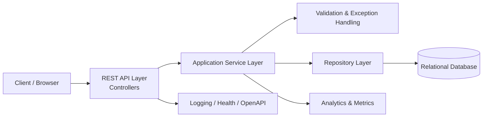

# Architecture Design: URL Shortener Platform

## 1. Executive Summary

The URL Shortener platform will be designed as a secure, cloud-ready, enterprise-grade service that supports short-link creation, resolution, lifecycle management, and basic analytics. The architecture will emphasize reliability, observability, and strong engineering controls while remaining practical for an MVP and suitable for future scale.

The platform vision is to deliver a service that is simple for users, resilient for operations, and defensible for review in a regulated environment. The design adopts an API-first, modular, and cloud-native approach, with AI used as an engineering accelerator rather than a substitute for human decision-making.

### Business Goals
- Provide a dependable short-link service for internal or external users.
- Support fast link creation and redirect operations.
- Enable operational visibility and basic governance for link management.

### Engineering Goals
- Deliver a scalable and maintainable platform.
- Ensure high availability and secure handling of redirect traffic.
- Build in observability, auditability, and safe deployment practices.

## 2. Architecture Principles

The architecture will follow these principles:

- Cloud Native: the solution should be deployable in a containerized and cloud-friendly environment.
- API First: interfaces will be explicitly defined and versioned.
- Clean Architecture: business logic will be separated from infrastructure and delivery concerns.
- Microservice Ready: the design will support decomposition into services if scope expands.
- Security First: input validation, access control, and secure defaults will be foundational.
- Reliability First: resilience patterns will protect critical create and redirect flows.
- Observability First: logging, metrics, tracing, and health monitoring will be built in from the start.
- AI Assisted Development: AI will accelerate analysis, documentation, testing, and review, while engineers retain ownership.

## 3. High Level Architecture

The platform will consist of the following major components:

### High-Level Diagram

### Frontend
A lightweight web or admin interface will allow users to create links and administrators to manage, search, and monitor link status. Its purpose is to provide a simple experience for core workflows while keeping the backend API as the system of record.

### Backend API Services
The backend will expose REST endpoints for:
- creating short links
- resolving short links
- managing link lifecycle state
- retrieving basic analytics and health information

This layer will contain domain logic for validation, alias generation, status handling, and response shaping.

### Database
A relational or document-backed store will preserve link mappings, metadata, status, and audit records. The database must support transactional writes for create and update operations and efficient read access for redirect resolution.

### Cache
A cache layer will optimize high-frequency redirect lookups and reduce direct database pressure during read-heavy traffic. Caching will be used carefully to avoid stale or inconsistent link state.

### Analytics Layer
The analytics component will capture aggregate usage events and operational metrics without becoming part of the critical redirect path. It will support reporting on access counts, last access time, and other basic telemetry.

### Monitoring and Observability
A monitoring plane will ingest logs, metrics, and traces from the application and infrastructure layers. This supports SRE-style operational visibility and faster incident diagnosis.

### AI Components
AI will support architecture review, requirement refinement, test generation, documentation drafting, and code review assistance. Human engineers will validate all results before acceptance.

### CI/CD
A continuous integration and delivery pipeline will automate build, test, scan, and deployment workflows. The pipeline will enforce quality gates before release.

### Deployment
The application will be deployed using containerized services with environment separation for development, test, UAT, and production. A blue-green or rolling deployment strategy will be used to reduce release risk.

## 4. Component Responsibilities

| Component | Purpose | Inputs | Outputs | Dependencies | Failure Handling |
|---|---|---|---|---|---|
| API Gateway / Edge Layer | Entry point for client requests and common policy enforcement | HTTP requests | Validated requests, throttling decisions | Backend services, authentication providers | Fail closed for invalid requests; return safe error responses |
| Link Service | Handles create, resolve, update, and status workflows | Long URL, alias, metadata | Short link record, redirect response, status update | Database, cache, audit service | Return controlled errors; rely on retries and fallback behavior |
| Validation Service | Validates URL safety and request structure | Input payloads | Approved or rejected request | URL policy rules, threat detection heuristics | Reject malformed input without escalation |
| Alias Generator | Produces unique short identifiers | Link context, uniqueness rules | Alias value | Database uniqueness check | Retry or fallback with alternate generation strategy |
| Persistence Layer | Stores link mappings, metadata, and audit events | Domain objects | Persisted records | Database | Use transactions and recovery-safe writes |
| Cache Layer | Accelerates redirect lookups | Alias key | Cached redirect target | Database, invalidation logic | Serve stale content only if acceptable; invalidate on update |
| Analytics Service | Collects operational and usage telemetry | Event data | Aggregated metrics and reports | Event queue or storage | Buffer or drop non-critical events under pressure |
| Audit Service | Records lifecycle and administrative changes | State changes | Audit log entries | Database or append-only sink | Preserve events even if downstream analytics are unavailable |
| Monitoring Stack | Collects logs, metrics, traces, and health data | Runtime signals | Dashboards, alerts, incidents | Application instrumentation | Degrade gracefully; alert on missing telemetry |
| CI/CD Pipeline | Automates build, test, scan, and release | Code changes, config | Deployable artifacts | Source control, test runners, security tools | Block deployment on failed quality gates |

## 5. Data Flow

### URL Creation
1. A client submits a long URL and optional metadata to the API.
2. The validation service checks URL format, policy compliance, and potential abuse signals.
3. The alias generator creates a unique short identifier.
4. The link service stores the mapping, metadata, and status in the database.
5. An audit event is recorded for the creation action.
6. The API returns the short link identifier and metadata to the client.

### URL Redirect
1. A client requests the short alias.
2. The API checks the cache for a recent redirect mapping.
3. If absent, the service retrieves the mapping from the database.
4. The service verifies the link is active and not expired.
5. The request is redirected to the target URL or a safe fallback response is returned.
6. A basic analytics event is recorded asynchronously.

### Analytics Collection
1. Redirect events are captured as lightweight telemetry.
2. The analytics component aggregates counts and timestamps.
3. Operational dashboards consume the aggregated data for monitoring and reports.

### Expiration
1. Link records include expiration metadata when configured.
2. The service evaluates expiry at resolution time and blocks access when expired.
3. Expired links are marked appropriately in audit records and operational views.

### Deletion
1. Deletion is handled as a controlled lifecycle action rather than an immediate destructive operation where possible.
2. The system marks links inactive or archived and preserves audit history.
3. Cleanup may be implemented later with retention policies and data lifecycle management.

## 6. AI Integration Strategy

AI will be used throughout the engineering lifecycle, but all outputs will be reviewed by engineers.

### Requirement Analysis
AI will help interpret business intent, identify ambiguities, and structure requirements into backlog-ready items.

### Architecture Review
AI will assist with trade-off analysis, consistency checks, and potential design risks, but the final architecture decision remains an engineering responsibility.

### Code Generation
AI may assist in generating scaffolding, API models, tests, and documentation drafts.

### Test Generation
AI will help produce unit, integration, and edge-case test ideas, especially for validation and resilience behavior.

### Documentation
AI will contribute to operational documentation, architecture summaries, and release notes.

### Code Review
AI will support pattern detection and review summarization, but human review will remain mandatory for correctness and security.

### Risk Analysis
AI will help model common failure scenarios, threat patterns, and release risks.

Engineer validation will be required for all AI-generated artifacts before use in production.

## 7. Security Architecture

### Authentication
Administrative and privileged operations should be protected with strong authentication. For MVP, role-based access control or basic identity integration may be sufficient, with stronger controls introduced later.

### Authorization
Only authorized users should be able to manage or disable links. API and UI roles should be enforced at the service boundary.

### Input Validation
All client inputs must be validated for structure, size, and allowed characters. URL validation should reject malformed and unsafe addresses and enforce policy where required.

### Secrets Management
Credentials, tokens, and other secrets will be stored securely in managed secret stores rather than embedded in code or configuration files.

### Encryption
Data in transit should use HTTPS. Sensitive data at rest should be encrypted using platform-supported mechanisms.

### Audit Logging
All administrative actions and major lifecycle changes should be recorded with actor, timestamp, and action details.

### OWASP Protection
The architecture will address common web application threats including injection, cross-site scripting, open redirect risks, and denial-of-service exposure through validation and rate limiting.

### Rate Limiting
Create and management endpoints should be rate-limited to reduce abuse and protect service availability.

### Dependency Scanning
The CI/CD pipeline will perform dependency scanning and vulnerability checks on third-party libraries and container images.

## 8. Reliability Architecture

### Retries
Transient errors should be retried with bounded exponential backoff for network and dependency failures.

### Circuit Breaker
Calls to external dependencies or slow subsystems should be protected by circuit breaker patterns to prevent cascading failures.

### Timeout
All upstream dependencies will have explicit timeout budgets to avoid resource starvation.

### Caching
Caching will reduce latency and offload reads, especially for high-frequency redirect requests.

### Health Checks
The service will expose liveness and readiness endpoints to support orchestration and deployment health decisions.

### Graceful Degradation
If analytics or non-critical services fail, the core create and redirect workflows should continue to operate.

### Blue Green Deployment
Production deployments should use blue-green or rolling deployment strategies to reduce impact and enable rollback.

### Auto Scaling
The platform should scale horizontally based on request volume and latency thresholds.

### High Availability
Critical services should be deployed with redundancy and health-based routing to avoid single points of failure.

### Disaster Recovery
The architecture should support backup, restore, and recovery procedures for the data store and configuration assets.

## 9. Observability

### Logging
Structured logs will record request context, outcome, latency, and errors. Logs will include correlation identifiers to support tracing and incident investigation.

### Metrics
The platform will expose metrics for request volume, latency, error rate, cache hit rate, database latency, and link resolution success.

### Distributed Tracing
Tracing will be enabled for request paths across the frontend, API, and data-store interactions to identify latency bottlenecks.

### Dashboards
Operational dashboards will provide visibility into service health, key business metrics, and error trends.

### Alerts
Alerts will be generated for elevated error rates, saturation, failed deployments, and unusual operational behavior.

### Health Endpoints
The service will expose health endpoints for readiness and liveness checks.

### Correlation IDs
Every request will carry a correlation ID to connect logs, traces, and monitoring data across components.

## 10. Database Design

### Logical Entities
- Link: stores the short alias, target URL, status, creation time, expiration metadata, and audit-related fields.
- LinkEvent: stores analytics or lifecycle events such as resolve attempts, state changes, or administrative actions.
- AuditRecord: stores immutable records of significant state transitions and administrative actions.

### Relationships
- One Link can have many LinkEvent records.
- One Link can have many AuditRecord entries.
- Link status and expiration metadata drive access rules for resolution.

### Indexing Strategy
- Index alias and status for fast lookup and filtering.
- Index creation time and expiration time for operational queries.
- Index audit records by object ID and timestamp for reviewability.

### Caching Strategy
- Cache resolved mappings by alias for short-lived periods.
- Use cache invalidation on status changes or URL updates.
- Avoid caching sensitive operational data beyond necessary limits.

## 11. Agent and Skill Design

Three custom agents support this workflow: Task Router, Greenfield Engineer, and Brownfield Engineer, all defined under [../.github/agents/](../.github/agents/).
Task Router is the triage step that reviews an incoming request, checks the existing codebase, and recommends whether the work should be handled as greenfield or brownfield before any implementation begins.
Numbered prompts under [../.github/prompts/](../.github/prompts/) are manually invoked at specific workflow stages, while skills under [../.github/skills/](../.github/skills/) are auto-invoked by the agents based on task context.
Greenfield Engineer invokes requirement-analysis, task-decomposition, api-contract-design, spring-boot-scaffolding, test-generation, and security-review.
Brownfield Engineer invokes requirement-analysis, task-decomposition, codebase-impact-analysis, regression-test-generation, refactor-safety-check, security-review, and documentation-sync.
This split was deliberately corrected once to ensure brownfield tasks are not undersupported, as documented in [docs/others/engineering-decisions.md](others/engineering-decisions.md).

## 12. API Strategy

### REST Principles
The API will use conventional REST patterns with consistent naming, resource-based URIs, and predictable error handling.

### Versioning
The public API should support versioning through explicit versioned paths or headers to preserve compatibility.

### Error Responses
The API will return structured error responses with error codes, messages, and trace identifiers.

### Pagination
List or admin endpoints should support pagination and filtering for large result sets.

### Validation
Request validation will occur at the API boundary and should provide clear feedback for invalid input.

### Idempotency
Create operations should support idempotency keys so repeated submissions do not create duplicates under retries or timeout scenarios.

## 12. Deployment Architecture

### Development
Developers will work in isolated local or containerized environments with shared test configuration and mocked or lightweight dependencies.

### QA
A dedicated QA environment will validate integration, regression, and acceptance scenarios.

### UAT
A UAT environment will support stakeholder validation of functional behavior and operational workflows.

### Production
Production will run with redundancy, monitoring, automated deployment controls, and rollback options.

### CI/CD Pipeline
The pipeline will include build, test, static analysis, security scan, packaging, and deployment stages.

### Docker
Containerization will support consistent deployment behavior across environments.

### Kubernetes
A Kubernetes-based environment is recommended for scalability, orchestration, and operational resilience.

### GitHub Actions
GitHub Actions or equivalent automation can orchestrate CI/CD workflows, quality gates, and release approvals.

## 13. Engineering Decisions

| Decision | Reason | Alternative | Trade-off |
|---|---|---|---|
| Use a modular service architecture | Supports maintainability and future scaling | Monolithic deployment | Slightly more upfront design complexity |
| Use a relational database for core link storage | Strong consistency and straightforward operational model | NoSQL document store | Higher structure and schema management overhead |
| Use cache for redirect lookups | Improves latency and reduces database load | No cache | Risk of stale data unless invalidation is designed well |
| Use asynchronous analytics processing | Protects the critical redirect path | Synchronous analytics writes | Eventual consistency for analytics |
| Use container-based deployment | Enables portability and repeatable environments | Bare metal deployment | Requires orchestration and image management discipline |
| Use blue-green deployment | Improves release safety | Direct in-place deployment | More infrastructure and operational overhead |

## 14. Risks

### Architecture Risks
- Overly complex design may reduce delivery speed.
- Tight coupling between redirect logic and analytics can impair scalability.
- Poor separation of concerns may complicate future service evolution.

### Security Risks
- Open redirect vulnerabilities may expose users to unsafe destinations.
- Weak access control may permit unauthorized link manipulation.
- Inadequate validation may allow injection or abuse patterns.

### Scalability Risks
- Unoptimized database access could create bottlenecks under load.
- Cache invalidation errors may lead to inconsistent redirects.
- Burst traffic may overwhelm non-optimized components.

### AI Risks
- AI-generated suggestions may introduce subtle errors or overlooked security issues.
- Over-reliance on AI may reduce engineering ownership and review quality.

### Mitigation
- Use architecture review checkpoints and clear component boundaries.
- Enforce security validation and quality gates.
- Add observability and performance testing early in delivery.
- Require engineer review of all AI-generated changes.

## 15. Future Enhancements

Potential next-step enhancements include:
- Multi-region failover and disaster recovery readiness.
- Advanced analytics such as device, geography, and campaign attribution.
- Vanity URL support and user-defined aliases.
- Full identity and access management integration.
- Event-driven integration with downstream security and monitoring systems.

## 16. Architecture Review Checklist

Before production approval, confirm that the following have been addressed:

- Business and engineering goals are clearly aligned with the proposed architecture.
- Core functional and non-functional requirements have been covered.
- Security controls for validation, access, secrets, and audit are documented.
- Reliability patterns for retries, timeouts, fallbacks, and deployment safety are present.
- Observability and alerting coverage support operational readiness.
- Database model and caching strategy are reviewed for scalability and consistency.
- CI/CD and release process include quality gates and rollback plans.
- AI-generated design suggestions have been reviewed and accepted by engineers.
- The solution is understandable, maintainable, and suitable for future extension.

## Architecture Diagrams

The following diagrams will be added after implementation to ensure they accurately reflect the final solution.

- High-Level Architecture
- Component Diagram
- Sequence Diagram – URL Creation
- Sequence Diagram – URL Redirect
- Deployment Diagram
- AI-Assisted Engineering Workflow